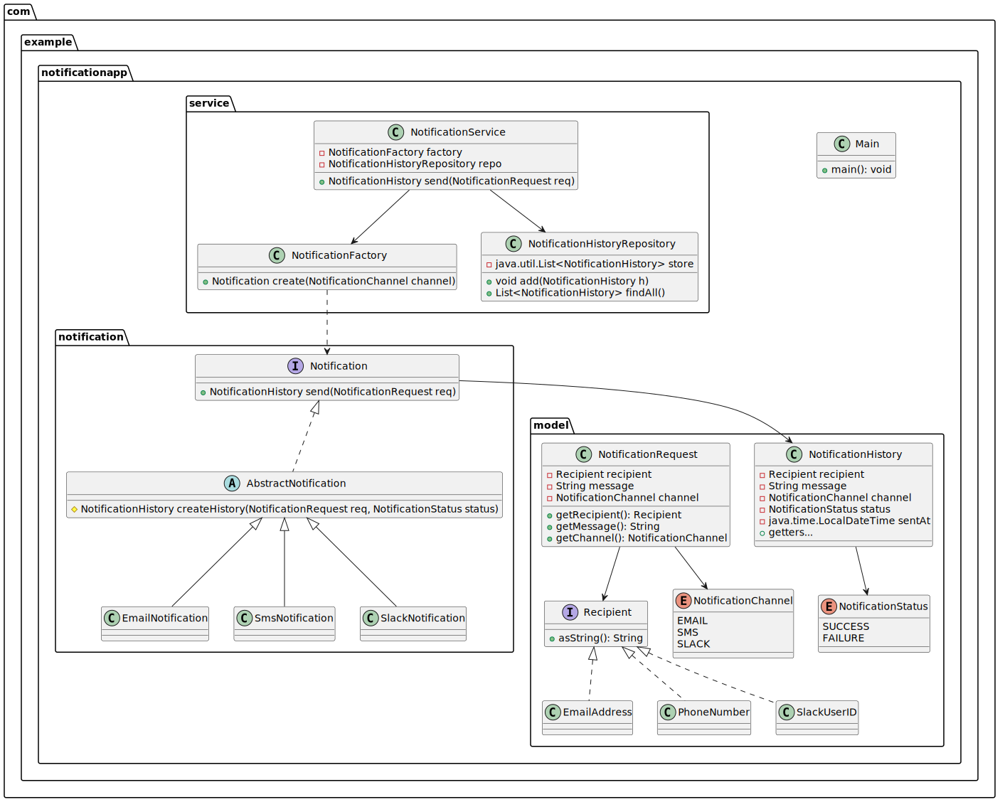
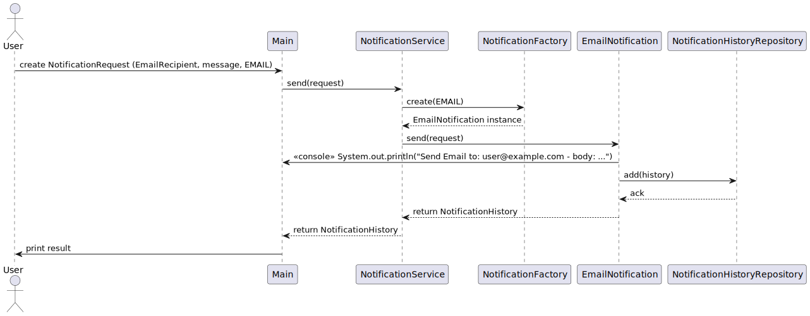

# Notification App – Java Polymorphism Training

このリポジトリは、新人 Java プログラマー向けに「ポリモーフィズム（多態性）」を中心としたオブジェクト指向の基礎を実践的に学ぶための課題です。

企業の情報システムにも登場しやすい「通知処理（メール・SMS・Slack 等）」を題材とし、  
ビジネスロジックをどのようにオブジェクト指向で構築するかを段階的に学びます。

---

## 📌 1. プロジェクト概要

### ■ 目的
- ポリモーフィズムの理解と実装
- インターフェースと実装クラスの役割理解
- 値オブジェクトの設計を体験
- ビジネスロジックの分離・階層化
- 次ステップ（Spring Framework の DI）につながる設計思想を習得

### ■ 機能概要
本アプリケーションはユーザーが通知リクエストを作成し、  
通知チャネル（Email、SMS、Slack）に応じて適切なサービスが処理を実行します。

処理結果は **NotificationHistory** として保持され、  
成功・失敗の履歴が標準出力に表示されます。

### ■ クラス図



| パッケージ | クラス名 | 役割 |
| --------- | ------- | ---- |
| com.example.notificationapp.notification | Notification | 通知処理の共通インターフェース |
| com.example.notificationapp.notification | AbstractNotification | 各種通知処理の共通処理を持つ抽象クラス |
| com.example.notificationapp.notification | EmailNotification | 通知処理（メール） |
| com.example.notificationapp.notification | SmsNotification | 通知処理（SMS） |
| com.example.notificationapp.notification | SlackNotification | 通知処理（アプリ通知） |
| com.example.notificationapp.model | NotificationRequest | 通知内容（宛先、内容）を保持するDTO |
| com.example.notificationapp.model | Recipient | 各種通知処理の宛先を表すスーパークラス |
| com.example.notificationapp.model | EmailAddress | メール通知処理の宛先を表すクラス |
| com.example.notificationapp.model | PhoneNumber | SMS通知処理の宛先を表すクラス |
| com.example.notificationapp.model | SlackUserID | Slack通知処理の宛先を表すクラス |
| com.example.notificationapp.model | NotificationChannel | 通知処理方式の列挙型 |
| com.example.notificationapp.model | NotificationStatus | 通知処理結果の列挙型 |
| com.example.notificationapp.model | NotificationHistory | 通知履歴を保持するDTO |
| com.example.notificationapp.sevice | NotificationFactory | 通知方法に応じて通知処理クラスのインスタンスを生成するクラス |
| com.example.notificationapp.sevice | NotificationService | 通知を実行するサービス層 |
| com.example.notificationapp.sevice | NotificationHistoryRepository | 通知履歴を保存するレポジトリ層。本課題においてはメモリ上に保持するのみ。 |
| com.example.notificationapp | Main | メイン関数 |

### ■ シーケンス図



---

## 📁 2. ディレクトリ構造
```
+-- docs
|    +-- task-order.md
|
+-- src
|    +-- main
|    |    +-- java/com/example/notificationapp
|    |    |    +-- model
|    |    |    +-- service
|    |    |    +-- notification
|    |    |    +-- Main.java
|    |    +-- resources
|    |
|    +-- test
|         +-- java
|         +-- resources
|
+-- pom.xml
+-- README.md
```
---

## ▶️ 3. 実行方法

### ■ 前提
- Java 17 以上
- Maven 3.8+  
  （`mvn -v` で確認）

### ■ 実行手順

#### 1. 依存ダウンロード & コンパイル

```shell
mvn clean compile
```

#### 2. 実行
```shell
mvn exec:java -Dexec.mainClass="com.example.notificationapp.Main"
```
または、JAR を作成して実行する場合：
```shell
mvn package
java -jar target/notificationapp-1.0.0-SNAPSHOT.jar
```

---

## 🧪 5. 動作例（標準出力）
```
=== Start Notification App ===
[Email] Sent to user@example.com
: "Hello!"
[SMS] Sent to 09012345678: "Hello!"
[Slack] Sent to U000999: "Hello!"

*** Notification History
2025/12/01 08:39:15 [Email] user@example.com "Hello!"
2025/12/01 08:40:02 [SMS] 09012345678 "Hello!"
2025/12/01 08:40:03 [Slack] U000999 "Hello!"
=== End Notification App ===
```

---

## 🚀 6. 拡張案（課題提出後に実施可能）

### 機能拡張
- Push / LINE / Teams などのチャネル追加
- NotificationHistory をファイルまたは DB に保存
- リクエストを JSON 化して入力データとして使う

### アプリケーションレベルの拡張
- Loggers を導入し、標準出力からログファイル出力へ
- JSON 入力で NotificationRequest を作成する（Jackson など導入）
- Retry 機能の追加（失敗時に 3 回まで再送）

### OOP の深化
- チャネル追加をもっと柔軟にする  
  → Factory の差し替え + Strategy パターン強化
- Validator の共通部分を抽象クラス化

### Spring Framework への接続
- NotificationService の生成を DI コンテナに任せる  
- Factory → @Configuration / @Bean に置き換え  
- Service を @Service アノテーションで管理

---

## 📄 7. 課題手順

課題を実施する順番は
docs/task-order.md を参照してください。
